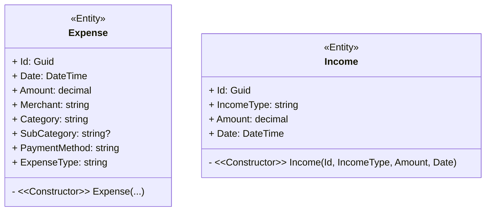

# budget-tracker-api

## Class Diagram

```mermaid
classDiagram-v2
    direction TB

    class Expense {
        <<Entity>>
        + Id: Guid
        + Date: DateTime
        + Amount: decimal
        + Merchant: string
        + Category: string
        + SubCategory: string?
        + PaymentMethod: string
        + ExpenseType: string
        - ~~Constructor~~ Expense(...)
    }

    class Income {
        <<Entity>>
        + Id: Guid
        + IncomeType: string
        + Amount: decimal
        + Date: DateTime
        - ~~Constructor~~ Income(Id, IncomeType, Amount, Date)
    }
```